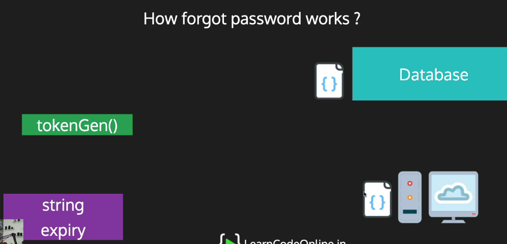

## How Does the Forgot Password Feature Work?

The forgot password feature allows users to reset their password if they have forgotten it. Here's how it works:

1. User requests a password reset: When a user clicks on the "forgot password" button on the login page, a request is sent to the server to reset their password.

2. Server generates a token: The server generates a unique token using a token generation method. This token contains long encrypted information and an expiry date. The token is then saved in the database along with the user's ID.

3. Token is sent to user: The token is sent to the user via email or some other method. The user will then use this token to reset their password.

4. User requests password reset with token: When the user receives the token, they will use it to reset their password. This can be done by clicking on a link in the email or by entering the token on a reset password page.

5. Token is verified: When the user sends the reset password request with the token, the server checks if the token is valid and has not expired. If the token is invalid or has expired, the reset password request will fail.

6. Password is updated: If the token is valid, the server will update the user's password in the database.

By following this process, users can easily reset their password if they forget it without having to contact support. It also ensures the security of the user's account by using a unique token that expires after a certain amount of time.```

