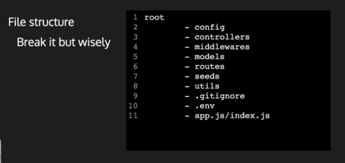

# backendForCoverChrome
this is backend app built using MREN stack for my back cover/cases for mobile phones.

## File Structure

This is the file structure of our backend project. As you can see, it consists of several directories and files that are organized in a logical manner to make development and maintenance easier.

## User Model

The User model is used to store user information for your ecommerce app.

### Fields

- `_id` (ObjectId) - The unique identifier for the user.
- `name` (String) - The name of the user.
- `email` (String) - The email address of the user. This field is unique and required.
- `password` (String) - The password for the user. This field is required and has a minimum length of 6 characters.
- `photo` (Object) - An object containing information about the user's profile photo.
  - `secure_url` (String) - The secure URL for the user's profile photo, retrieved from Cloudinary.
  - `id` (String) - The unique identifier for the user's profile photo, retrieved from Cloudinary.
- `role` (String) - The role of the user, such as "customer" or "admin".
- `createdAt` (Date) - The date when the user's account was created.

Additional fields can be added as needed to store other user information, such as shipping address or payment details.

This model can be implemented using an ORM like Mongoose for a MongoDB database or Sequelize for a SQL database.

## Product Model

The Product model is used to store information about the products available on your ecommerce app.

### Fields

- `name` (String) - The name of the product.
- `price` (Number) - The price of the product.
- `description` (String) - A brief description of the product.
- `photos` (Array) - An array of objects, each containing information about a photo of the product.
  - `secure_url` (String) - The secure URL for the photo, retrieved from Cloudinary.
  - `id` (String) - The unique identifier for the photo, retrieved from Cloudinary.
- `category` (String) - The category of the product. This can be an enumerated type to limit the options available for selection.
- `brand` (String) - The brand of the product.
- `stock` (Number) - The number of units of the product currently in stock.
- `ratings` (Number) - The average rating for the product.
- `numReviews` (Number) - The number of reviews for the product.
- `reviews` (Array) - An array of objects, each containing information about a review for the product.
  - `user` (ObjectId) - The unique identifier for the user who submitted the review.
  - `name` (String) - The name of the user who submitted the review.
  - `rating` (Number) - The rating given by the user for the product.
  - `comment` (String) - The comment left by the user for the product.
- `user` (ObjectId) - The unique identifier for the user who added the product.
- `createdAt` (Date) - The date when the product was added to the system.
